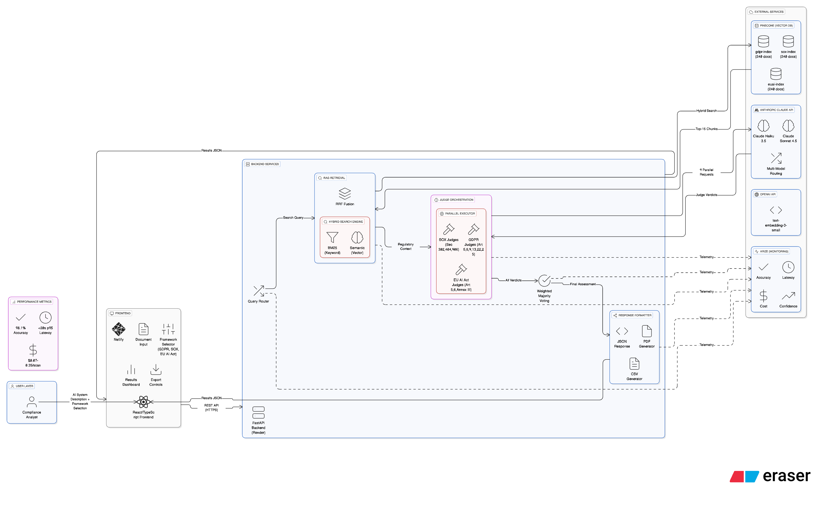

# Sovereign — Multi-Framework AI Compliance Platform

> Sovereign scans an AI system against **EU AI Act, SOX, and GDPR** and returns a
> defensible, evidence-linked compliance assessment in under 20 seconds — replacing
> a review cycle that normally takes 2–6 weeks.

**[🔗 Live demo](https://sovereign-compliance.netlify.app/)** · **[📄 Product Requirements Doc](https://github.com/div28/sovereign-v5/blob/ddd8467e239ddba4d958a910dbaf8b1f87b0f287/Sovereign%20Latest%20_%20Multi-Framework%20AI%20Compliance%20Platform%20%E2%80%93%20Product%20Requirements%20Document%20%28PRD%29.docx)** · **[🏗 Architecture](docs/architecture.png)**

---

## Snapshot

| Metric | Result |
|---|---|
| Compliance-decision accuracy | **98.1%** |
| True-positive (recall) rate | **95.8%** |
| p95 assessment latency (multi-framework) | **< 20s** |
| Cost per scan | **$0.07–$0.35** |
| Validation set | **200-scenario golden dataset**, 5-fold cross-validation |
| Frameworks | EU AI Act · SOX · GDPR (9 specialized judges, 3 per framework) |

*Numbers from the latest evaluation run — re-verify before publishing if you've changed the judges or dataset since.*

## The Problem

Enterprises are pushing AI into regulated workflows faster than compliance teams can interpret, audit, and document the requirements. Reviews average **2–6 weeks per AI use case with 25–40% rework**, regulations change monthly, and manual processes can't scale across EU AI Act, SOX, and GDPR at once. The result is costly delays, inconsistent decisions, and material risk exposure.

**Who feels it:** legal, risk, and engineering teams at regulated enterprises (finance, tech, insurance, healthcare) who need fast, defensible compliance decisions they can put in front of an auditor.

## What Sovereign Does

A compliance analyst uploads an AI system description, selects the relevant frameworks, and within seconds gets a consolidated dashboard and exportable report: obligation-by-obligation findings, confidence scores, evidence citations, and remediation guidance — across all three frameworks at once.

The design principle throughout: **decisions must be defensible.** Every verdict is grounded in retrieved regulatory text with source-pinned citations, not a model's unsupported judgment.

## Architecture



The flow, left to right:

1. **Frontend** (React/TypeScript on Netlify) — document input, framework selector, results dashboard, and JSON/PDF/CSV export controls.
2. **FastAPI backend** (Python 3.11 on Render) — exposes the REST API and runs the pipeline.
3. **Advanced RAG retrieval** — a hybrid search engine combining **BM25 (keyword)** and **semantic (vector)** retrieval, merged with **Reciprocal Rank Fusion**, over three Pinecone indexes (`gdpr`, `sox`, `euai`; ~720 regulatory docs total). Embeddings via OpenAI `text-embedding-3-small`.
4. **Judge orchestration** — **9 specialized LLM judges** (3 per framework) run in **parallel**, each mapped to specific provisions (e.g. SOX §302/404/906; GDPR Art. 5/6/9/13/22/25; EU AI Act Art. 5/6 + Annex III).
5. **Multi-model routing** — Claude **Haiku 3.5** for stable, structured checks; Claude **Sonnet 4.5** for ambiguous or evolving determinations; fallback/abstain on low confidence.
6. **Weighted majority voting** consolidates the judges' verdicts into a final assessment.
7. **Observability** — latency, cost, accuracy, and confidence telemetry streamed to Arize.

## Key Decisions & Tradeoffs

- **Multi-model routing over a single model.** Cheap/fast Haiku handles the bulk of stable obligations; Sonnet is reserved for the ambiguous calls. This is what keeps cost at $0.07–0.35/scan *and* accuracy high — you don't pay frontier-model prices for checks that don't need them.
- **Hybrid retrieval (BM25 + vector + RRF), not vector-only.** Regulatory language is precise; pure semantic search misses exact article references, while keyword search alone misses paraphrased obligations. Fusing both recovers the cases either misses.
- **Source-pinned citations.** Every finding links back to the regulatory text it's grounded in — the difference between "trust the model" and an audit-ready artifact.
- **Parallel judge execution.** A `ThreadPoolExecutor` fans out all 9 judges concurrently with timeouts and backoff, which is what gets multi-framework assessment under the 20s p95 bar.

## Evaluation

- **200-scenario golden dataset** spanning all three frameworks, with labeled ground truth.
- **Stratified train/val/test splits** and **5-fold cross-validation**.
- **Nightly regression** plus judge-level canaries, version pinning, and diff reporting, so accuracy can't silently drift as prompts or models change.

See `evals/` for the harness and scenarios.

## Tech Stack

Frontend: React/TypeScript (Netlify) · Backend: Python 3.11 + FastAPI (Render) · Retrieval: Pinecone + OpenAI embeddings + BM25/RRF hybrid search · Judging: Anthropic Claude (Haiku 3.5 + Sonnet 4.5) · Observability: Arize

## Run It Locally

```bash
git clone https://github.com/div28/sovereign-v5.git
cd sovereign-v5
cp .env.example .env
pip install -r backend/requirements.txt
uvicorn app:app --reload
```

## Roadmap

Architected in V1 but **not** in the current deployment — listed honestly so the scope above is exactly what's built:

- Self-improvement agent (error-log-driven prompt tuning, online A/B testing)
- Enterprise controls: RBAC, OIDC SSO, AES-256 at rest, audit trails, SOC 2 readiness
- Integrations: Jira, ServiceNow, Slack, SIEM, GRC
- Regulatory change control: semantic watchlist, version-aware diffs, impact reruns
- Expansion to HIPAA, PCI, COPPA

## Impact (illustrative model)

Against a manual baseline (~$8.5K and 4 weeks per assessment), Sovereign's per-scan cost plus residual human review models out to a **70–90% reduction in review time** and roughly **$900K/enterprise/year** in savings at 120 assessments/year. (An estimating model from the PRD, not measured customer outcomes.)

---

*Built by Divya Nag — [LinkedIn](https://www.linkedin.com/in/divyanag/)*
